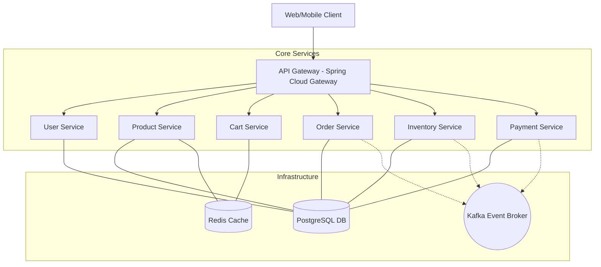
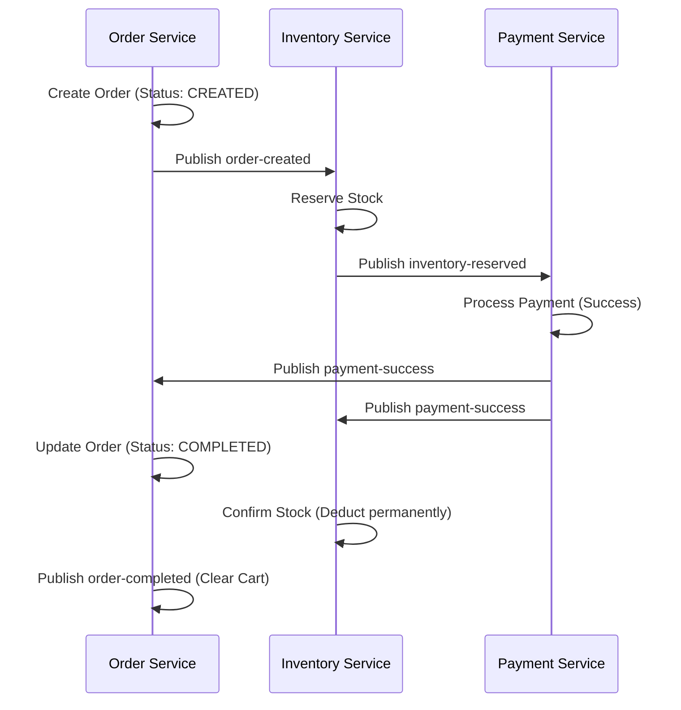
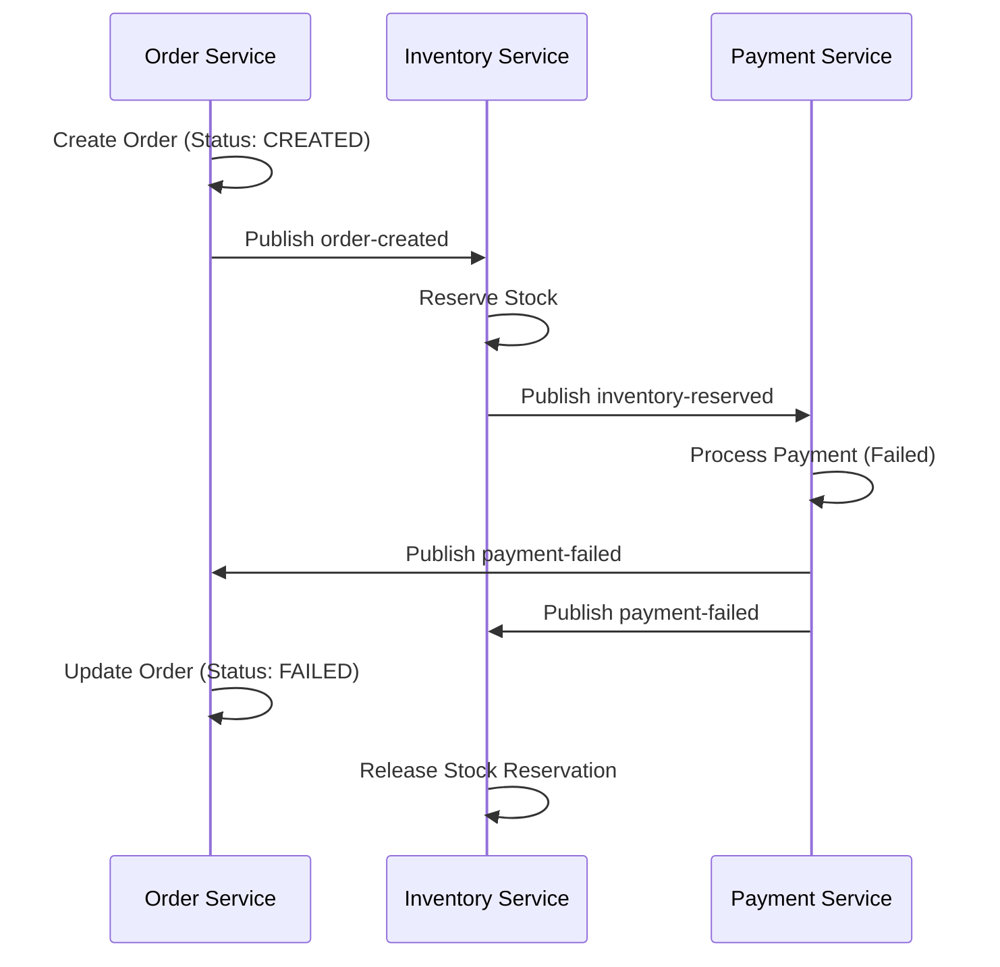

# 🛒 E-commerce Microservices Ecosystem

A professional-grade, event-driven e-commerce platform built with Spring Boot microservices, featuring centralized security, distributed caching, and eventually consistent stock management.

---

## 🏗️ System Architecture

The platform utilizes a modern microservices architecture with a centralized **API Gateway** managing security and traffic routing.

---

## 🔐 Centralized Security Workflow

Security is decoupled from business logic and enforced at the **Edge Level**.

1.  **Authentication**: Handled by `UserService`. Client receives a JWT upon login.
2.  **Validation**: Every request is intercepted by the **API Gateway**'s `JwtFilter`.
3.  **Identity Propagation**: Upon successful validation, the Gateway injects user identity into headers:
    *   `X-User-Id`
    *   `X-User-Role`
    *   `X-User-Email`
4.  **Trust Model**: Downstream services use a shared `GatewayHeaderFilter` to automatically populate the `SecurityContext` based on these trusted headers.

---

## 🔄 Event-Driven Flows (Saga Pattern)

The system manages distributed transactions using the Saga pattern via Kafka to ensure eventual consistency.

### 🟢 Order Success Path

### 🔴 Payment Failure Compensating Flow

---

## ⚡ Distributed Caching

Distributed caching is implemented using **Redis** to minimize database load and improve latency.

*   **Shopping Cart**: Fully cached in Redis for sub-millisecond access. Cache is automatically invalidated upon order completion.
*   **Product Catalog**: High-demand products are cached, with TTL-based eviction and manual eviction on updates.
*   **User Sessions**: JWT metadata and frequent user lookups are optimized via Redis.

---

## 🚀 API Reference Quick-Look

| Service | Endpoint | Description | Auth |
| :--- | :--- | :--- | :--- |
| **User** | `POST /api/users/login` | Authenticate & get JWT | Public |
| **Product** | `GET /api/products` | Browse catalog (Cached) | Public |
| **Cart** | `POST /api/carts/items` | Add items to cart | User |
| **Order** | `POST /api/orders` | Initiate saga flow | User |

> [!TIP]
> Use the **API Gateway** on port `8080` for all external requests. Direct service access is blocked.

---

## 🛠️ Technology Stack

| Component | Technology |
| :--- | :--- |
| **Framework** | Spring Boot 3.2+ |
| **Gateway** | Spring Cloud Gateway |
| **Persistence** | PostgreSQL |
| **Messaging** | Apache Kafka |
| **Caching** | Redis |
| **Security** | Spring Security & JJWT |
| **Build Tool** | Maven |
