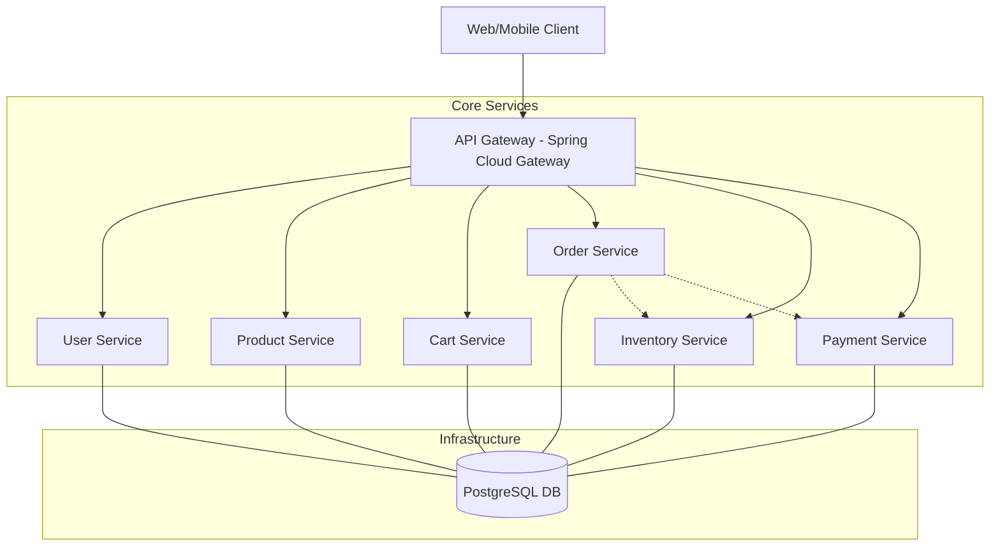
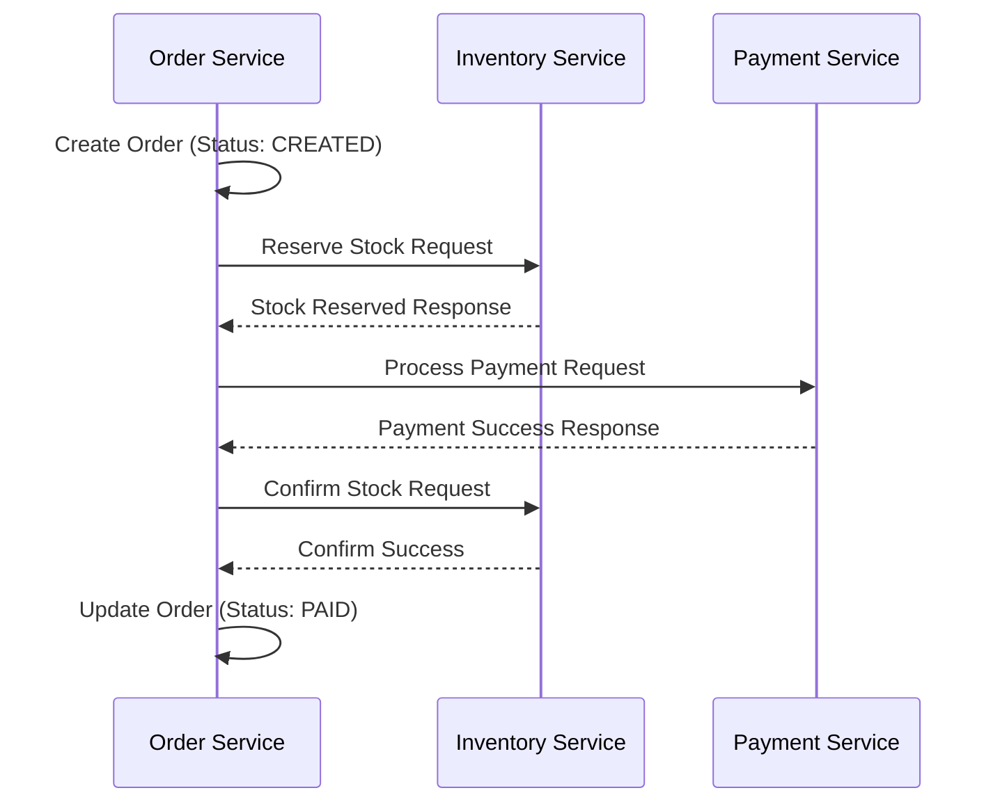
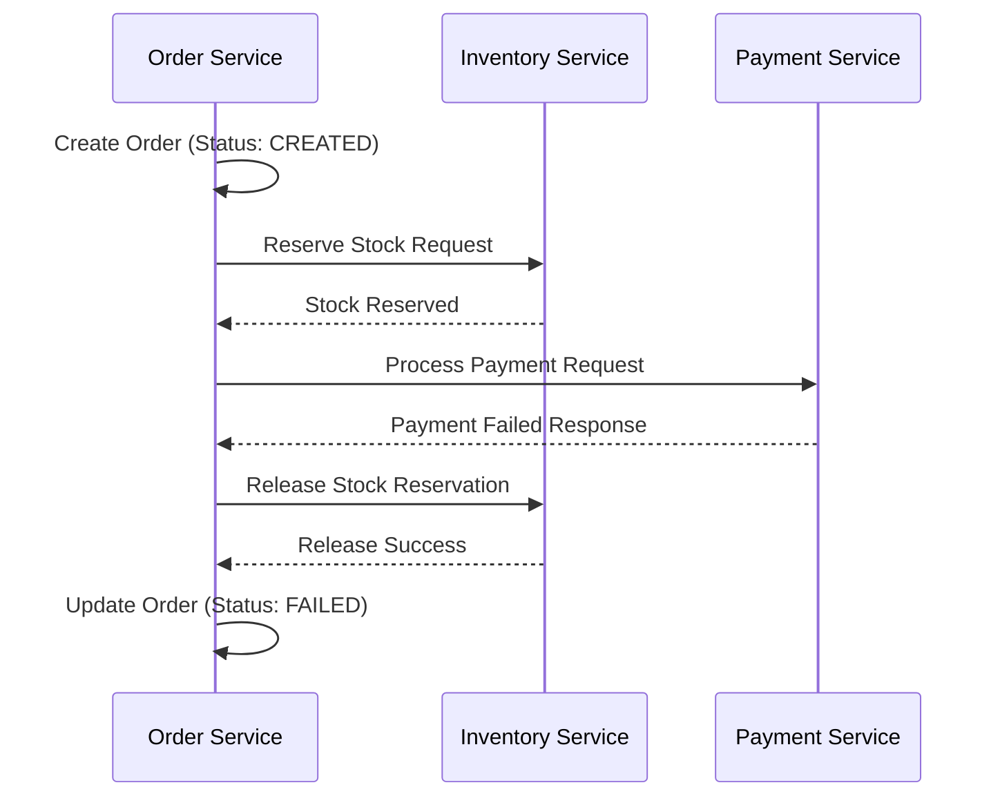

# E-commerce Microservices Ecosystem

[](https://spring.io/projects/spring-boot)
[](https://www.oracle.com/java/)
[](https://www.postgresql.org/)
[](https://www.docker.com/)

A professional-grade e-commerce platform built with Spring Boot microservices, featuring centralized security and synchronous orchestration for order management.

---

## System Architecture

The platform utilizes a modern microservices architecture with a centralized API Gateway managing security and traffic routing.


```mermaid
graph TD
    Client[Web/Mobile Client] --> Gateway[API Gateway - Spring Cloud Gateway]
    
    subgraph "Core Services"
        Gateway --> UserService[User Service]
        Gateway --> ProductService[Product Service]
        Gateway --> CartService[Cart Service]
        Gateway --> OrderService[Order Service]
        Gateway --> InventoryService[Inventory Service]
        Gateway --> PaymentService[Payment Service]
    end
    
    subgraph "Infrastructure"
        Postgres[(PostgreSQL DB)]
    end
    
    UserService --- Postgres
    ProductService --- Postgres
    CartService --- Postgres
    OrderService --- Postgres
    InventoryService --- Postgres
    PaymentService --- Postgres
    
    OrderService -.-> InventoryService
    OrderService -.-> PaymentService
```

---

## Centralized Security Workflow

Security is decoupled from business logic and enforced at the Gateway and Inter-Service levels.

1.  **Authentication**: Serviced by `UserService`. Client receives a JWT upon login.
2.  **API Gateway Routing**: Requests are routed through the Gateway.
3.  **Internal JWT Configuration**: Inter-service communication uses an `InternalJwtConfig` token-based approach to authenticate downstream requests reliably (e.g. from Order Service to Payment and Inventory services).

---

## Synchronous Orchestration

The system manages transactions using synchronous REST calls with `RestTemplate` for order processing.

### Order Success Path

```mermaid
sequenceDiagram
    participant OS as Order Service
    participant IS as Inventory Service
    participant PS as Payment Service
    
    OS->>OS: Create Order (Status: CREATED)
    OS->>IS: Reserve Stock Request
    IS-->>OS: Stock Reserved Response
    OS->>PS: Process Payment Request
    PS-->>OS: Payment Success Response
    OS->>IS: Confirm Stock Request
    IS-->>OS: Confirm Success
    OS->>OS: Update Order (Status: PAID)
```

### Payment/Stock Failure Compensating Flow

```mermaid
sequenceDiagram
    participant OS as Order Service
    participant IS as Inventory Service
    participant PS as Payment Service
    
    OS->>OS: Create Order (Status: CREATED)
    OS->>IS: Reserve Stock Request
    IS-->>OS: Stock Reserved
    OS->>PS: Process Payment Request
    PS-->>OS: Payment Failed Response
    OS->>IS: Release Stock Reservation
    IS-->>OS: Release Success
    OS->>OS: Update Order (Status: FAILED)
```

---

## API Documentation

All requests should be routed through the API Gateway on port `8080`.

### User Service
| Method | Endpoint | Description | Auth |
| :--- | :--- | :--- | :--- |
| `POST` | `/api/users/register` | Register a new user | Public |
| `POST` | `/api/users/login` | Login and receive JWT | Public |
| `GET` | `/api/users` | List all users | ROLE_ADMIN |

### Product Service
| Method | Endpoint | Description | Auth |
| :--- | :--- | :--- | :--- |
| `GET` | `/api/products` | Get all products (Paginated) | Public |
| `GET` | `/api/products/{id}` | Get product details | Public |
| `POST` | `/api/products` | Create a new product | ROLE_ADMIN |
| `DELETE` | `/api/products/{id}` | Remove a product | ROLE_ADMIN |

### Cart Service
| Method | Endpoint | Description | Auth |
| :--- | :--- | :--- | :--- |
| `GET` | `/api/cart` | View personal shopping cart | ROLE_CUSTOMER |
| `POST` | `/api/cart/add` | Add product to cart | ROLE_CUSTOMER |
| `DELETE` | `/api/cart/{productId}` | Remove item from cart | ROLE_CUSTOMER |
| `POST` | `/api/cart/checkout` | Trigger order checkout | ROLE_CUSTOMER |

### Order Service
| Method | Endpoint | Description | Auth |
| :--- | :--- | :--- | :--- |
| `POST` | `/api/orders` | Create an order | ROLE_CUSTOMER |

### Inventory Service (Internal/Admin)
| Method | Endpoint | Description | Auth |
| :--- | :--- | :--- | :--- |
| `POST` | `/api/inventory/add` | Add stock for a product | ROLE_ADMIN |
| `POST` | `/api/inventory/reserve/{orderId}` | Reserve stock for order | Internal |
| `POST` | `/api/inventory/confirm/{orderId}` | Finalize stock deduction | Internal |
| `POST` | `/api/inventory/release/{orderId}` | Rollback stock reservation | Internal |

### Payment Service (Internal)
| Method | Endpoint | Description | Auth |
| :--- | :--- | :--- | :--- |
| `POST` | `/api/payment/process` | Mock payment processing | Internal |

---

## Detailed Request Specifications

### Add to Cart
**Endpoint:** `POST /api/cart/add`
```json
{
  "productId": "uuid-here",
  "quantity": 2
}
```

### Create Order (Direct)
**Endpoint:** `POST /api/orders`
```json
{
  "items": [
    {
      "productId": "uuid-1",
      "quantity": 1,
      "price": 299.99
    }
  ]
}
```

---

## Technology Stack

| Component | Technology | Badge |
| :--- | :--- | :--- |
| **Framework** | Spring Boot 3.3.5 | [](#) |
| **Language**  | Java 17 | [](#) |
| **Gateway** | Spring Cloud Gateway | [](#) |
| **Persistence** | PostgreSQL | [](#) |
| **Security** | Spring Security & JJWT | [](#) |
| **Containerization** | Docker Compose | [](#) |
| **Build Tool** | Maven | [](#) |
